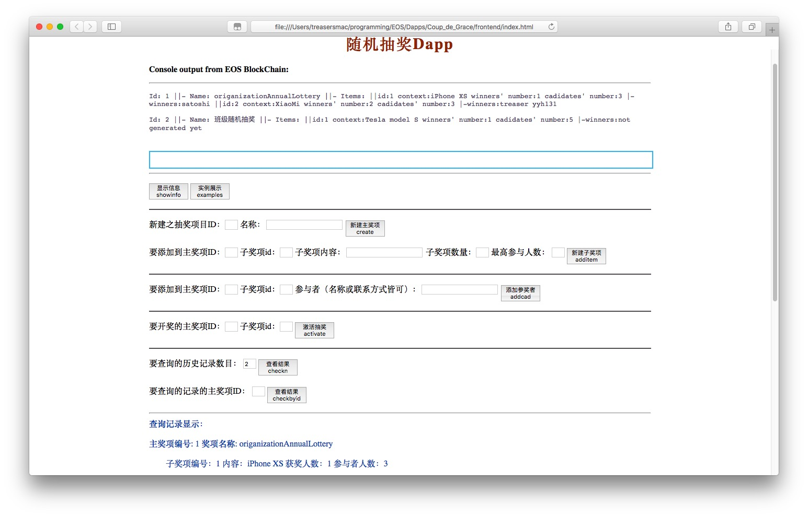

# 要求
搭建私有链，设想某个去中心化应用场景，编写智能合约，完成智能合约的编译、部署和调用。基于任意架构的区块链平台开发一款可运行的DApp。
### 提交内容
1. 完整源代码
2. word说明文档（包括：）
	* 开发环境搭建
	* 功能设计
	* 合约设计
	* 系统实现和部署
	* 主要界面截图与说明
	
# 功能概述(Introduction)
1. 能实现创建抽奖主奖项，并在主奖项下添加子奖项。比如创建“协会活动抽奖”这个主奖项，并在下面添加“一等奖”、“二等奖”等子奖项。创建后显示创建奖项的交易哈希值。
2. 能单方面添加奖项参与者，具体到子奖项。比如添加10位参与抽“二等奖”。
3. 能单方面对某一子奖项开奖。并将抽奖结果自动上链。
4. 能查询历史记录。可以按主奖项ID为索引值进行查询，也可以查询历史中前n个记录。

# 智能合约()



1.开奖方式：手动开奖
2.是否需要签名
3.创建完以后输入二维码
4.项目状态：待开奖、以结束
5.抽奖名单审核

具体实现
## 智能合约：
抽奖完成后接受到抽奖者的数据：
抽奖项目{奖项，获得者1的手机，获得者i的手机}
存到区块链。
### 解决了随机数
使用了基于区块数据的随机数产生算法：
### 解决了Multi_index的table下的vector的元素中的vector的元素的压栈
```
surpriseprjs.modify(iterator, author, [&](auto& surpriseprj) { 
	surpriseprj.items[item_id-1].winners.push_back(winner);
});
```

## 客户端：

加入抽奖、创建抽奖、查看抽奖历史三大功能

加入抽奖{
你要参与的抽奖项目名：
你的联系方式手机：
你的姓名：
你的验证信息（学号）：
}
创建抽奖{
分类：单方抽奖、交互抽奖
你要创建的抽奖项目名：
奖项数目：i
奖项1{名称；人数}
...
奖项i{名称；人数}
从待抽奖者池中随机选择进行抽奖。
显示抽奖结果。
抽完后选择上传到区块链或者放弃重抽。
单方抽奖待抽奖者池为数字，
交互抽奖待抽奖者池为用户的手机号。
}
