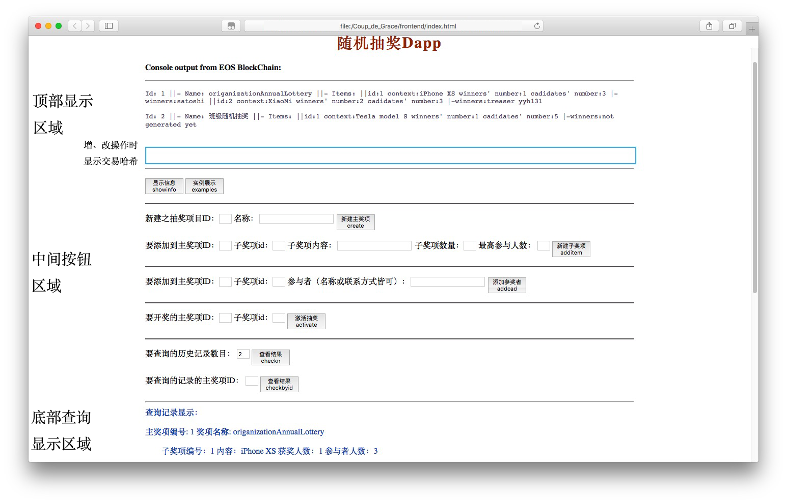

# 要求
搭建私有链，设想某个去中心化应用场景，编写智能合约，完成智能合约的编译、部署和调用。基于任意架构的区块链平台开发一款可运行的DApp。
### 提交内容
1. 完整源代码
2. word说明文档（包括：）
	* 开发环境搭建
	* 功能设计
	* 合约设计
	* 系统实现和部署
	* 主要界面截图与说明
	
# 功能概述(Introduction)
1. 能实现创建抽奖主奖项，并在主奖项下添加子奖项。比如创建“协会活动抽奖”这个主奖项，并在下面添加“一等奖”、“二等奖”等子奖项。创建后显示创建奖项的交易哈希值。
2. 能单方面添加奖项参与者，具体到子奖项。比如添加10位参与抽“二等奖”。
3. 能单方面对某一子奖项开奖。并将抽奖结果自动上链。
4. 能查询历史记录。可以按主奖项ID为索引值进行查询，也可以查询历史中前n个记录。

# 智能合约(Contract Part Design)
EOS的智能使用C++开发（也可以使用其他语言），限于时间所限，第一版抽奖软件比较简单，只需要一个[Surprise](https://github.com/treasersimplifies/Coup_de_Grace/tree/master/contract/Surprise)合约就能实现既定功能。

在这个合约里定义/实现了如下内容：
### action

* showinfo:用于显示合约相关信息。       ```void showinfo();```
* create:用于新建主奖项。      ```void create(const account_name author, uint64_t project_id, string& project_name);```
* additem:用于向某个主奖项下添加子奖项。    ```void additem(const account_name author, uint64_t project_id, uint64_t item_id, string& item_name, uint32_t winumber, uint32_t maxnumber);```
* addcad:用于向某主奖项下的子奖项添加参与者。    ```void addcad(const account_name author, uint64_t project_id, uint64_t item_id, string& cadname);```
* activate:用于针对某主奖项下的子奖项的开奖。   ```void activate(const account_name author, uint64_t project_id, uint64_t item_id);```
* checkbyid:用于查询奖项记录。   ```void checkbyid(const account_name author, uint64_t project_id);```
* checkn:用于查询奖项记录。      ```void checkbyid(const account_name author, uint64_t project_id);```

### 数据结构(data structure)

1. 子奖项结构

```
struct surpriseitem{
    uint64_t id;
    string name;
    uint32_t winumber; 
    uint32_t maxnumber;
    vector<string> cadidates;//phone number
    vector<string> winners;//phone number

    uint64_t primary_key() const { return id; }
    // EOSLIB_SERIALIZE(surpriseitem, (id)(name)(number))
};
```

2. 主奖项结构

```
struct surpriseprj{
    uint64_t id;
    string name;
    vector<surpriseitem> items;//
    
    uint64_t primary_key() const { return id; }
    // EOSLIB_SERIALIZE(surpriseprj, (id)(name))
};         
```
### Multi_Index
定义了一个Multi_Index的table：

```typedef multi_index<N(surpriseprj), surpriseprj> surpriseprjIndex;```

然后是关于这个table的增、改、查操作等：

```
surpriseprjIndex surpriseprjs(_self, _self);
//增：
surpriseprjs.emplace(author, [&](auto& surpriseprj) {
    surpriseprj.id = project_id;
    surpriseprj.name = project_name;
});
//改：
surpriseprjs.modify(iterator, author, [&](auto& surpriseprj) {
    surpriseprj.items.push_back(surpriseitem{
        item_id,
        item_name,
        winumber,
        maxnumber
    });
});
//查：
auto theprj = surpriseprjs.get(project_id);
print("||| Id: ", theprj.id);
print(" ||- Name: ", theprj.name.c_str());
print(" ||- Items: ");    
```

### 随机数(random number)
EOS无法使用```#include<random>```，所以需要寻找其他的随机源。

参考了：[generEOS/eosio.random](https://github.com/generEOS/eosio.random)和[Randomization in Contracts](https://developers.eos.io/eosio-cpp/docs/random-number-generation)

原理是：通过区块数据来作为种子，产生哈希，比较不同的哈希得出比较结果，把比较结果作为随机数。因为哈希函数的输出无法预知，所以视为随机的来源。

```
int lucky[MAX_CAD];//
if(winumber<=cadnumber){
    for(int i=0; i<cadnumber; ){
        checksum256 result;
        auto mixedBlock = tapos_block_prefix() * tapos_block_num();
        const char *mixedChar = reinterpret_cast<const char *>(&mixedBlock);
        sha256( (char *)mixedChar, sizeof(mixedChar), &result);
        const char *p64 = reinterpret_cast<const char *>(&result);
        auto r = (abs((int64_t)p64[i]) % (cadnumber + 1 - 1)) + 1;  //1 to cadnumber
        int need_to_repeat=0;
        for(int j=0;j<5;j++){
            if(r==lucky[j]){
                need_to_repeat=1;
                break;
            }
        }
        if(need_to_repeat==0){
            print(" ", r);
            lucky[i++]=r;
        }
        if(i==winumber)break;
    }
}else{
    for(int i=0;i<cadnumber;i++){
        lucky[i]=i+1;
        print(" ", i+1);
    }
}
```

### Multi_index的table下的vector的元素中的vector的元素的压栈

```
surpriseprjs.modify(iterator, author, [&](auto& surpriseprj) { 
	surpriseprj.items[item_id-1].winners.push_back(winner);
});
``` 

# 前端(Frontend Part Design)
前端界面如下：

因为前端比较简单，所有直接写在一个html文件中了,需要引入如下文件，都位于eosjs库中（eosjs库的引入见下“ ”）：


```
<script src='eosjs/dist-web/eosjs-api.js'></script>
<script src='eosjs/dist-web/eosjs-jsonrpc.js'></script>
<script src='eosjs/dist-web/eosjs-jssig.js'></script>
```

前端的界面：分三部分，**顶部显示区域**、**中间按钮区域**、**底部查询显示区域**。

### 顶部显示区域
将与智能合约进行交互得到的输出作简单处理后显示在此。

而其中的蓝色方框内能显示对抽奖项目进行增、改操作时的交易哈希值。

### 中间按钮区域
每个按钮都一一、严格地对应一个合约中的action，而按钮旁边的输入框都是用来逐个输入逐个action需要的参数的。原理很简单。


### 底部查询显示区域
进行查操作（按下查询按钮）后显示记录的区域。

**注意：查询前最好按下“显示信息”按钮来看看链上有多少个抽奖记录，不能越界。**


# 系统实现和部署
## 系统集成
编写完合约和前端后进行集成，项目结构：

```
Coup_de_Grace								
	  |-contract							  
	  		|-Surprise					       
	  			  |-Surprise.hpp
	  			  |-Surprise.cpp
	  			  |-Surprise.abi
	  			  |-Surprise.wasm
	  |-frontend
	  		|-index.html
	  		|-index.css
	  		|-eosjs
	  		|-src
	  |-README.md
	  |-test.sh
```
如果没有eosjs，则需要自己引入：

```
# 在此之前自然要装好node.js和npm
# in test.sh:
cd ${DappsDIR}/frontend
git clone https://github.com/EOSIO/eosjs.git 
cd eosjs
npm install
npm run build-web
```
## 部署准备工作
部署前需要启动本地EOS单点节点（相当于以太坊私有链），然后创建好测试本项目要使用的钱包、导入账户密钥、创建账户（这些过程在test.sh中都有）：

```
# in test.sh:
# 0.0 edit the config.ini: ~/Library/Application Support/eosio/nodeos/config 
# to enable plugins of eos private node you are about to start and:
nodeos
#      or 
# 0.1 Start the nodeos with :
nodeos -e -p eosio --plugin eosio::producer_plugin --plugin eosio::chain_api_plugin --plugin eosio::http_plugin --plugin eosio::history_api_plugin  --contracts-console --verbose-http-errors --enable-stale-production --max-transaction-time 3000
```
是的，你确实需要激活这么多插件，否则你无法测试本项目了...比如：

```http_plugin --plugin ```是为了激活RPC API

```--contracts-console```是为了激活控制台输入，如果不激活，那你向智能合约发生action时你的命令行里就没有输出了

```--max-transaction-time 3000```是为了提高交易执行超时时间，默认是30ms，因为产生随机数需要不少时间（相对于程序其他部分而言），所以如果一次性随机抽奖的人数过多就会超时，导致交易无法执行。

这么多插件、参数的必要性都是在我尝试了很多次以后通过经验再加上EOSIO官网的文档得出的。建议通过编辑config.ini文件来修改这些参数，这样你就默认使能这些东西了。其他的插件说明见：[EOSIO nodeos plugins](https://developers.eos.io/eosio-nodeos/docs/history_api_plugin)


```
# in test.sh:
# 1. Create new wallet with the name "cdg"(or whatever name you like) for this project
cleos wallet create -n cdg --to-console
##// my key(for test only): PW5KfKXy8qXD3JbKZ3RosqS6PYfm9eBjx2mHveVm4T4dfz7d4LrFE
cleos wallet unlock -n cdg

# 2. Generate two pair of keys (use the command twice for an account OwnerKey and ActiveKey 2-level authority)
cleos create key --to-console
cleos create key --to-console
## my Private key: 5KamKnnmFZD1pBLKmGweoVafFkxvr9R6xPYbKLwEoEviVcivBWt
## my Public key: EOS5rhWHPySUdtDTPWMkqiatv3xgU2EPwKnjSe4Vr3eYFUA1dPPeB
## my Private key: 5JurHoxQEbRtgKeeb7ZN28PECn92wJrgVSrP4f3dyPHxMY1NABC
## my Public key: EOS8XjjYgLcUkBbHYSacgsx2CRnbToApiwkNoaEk5ft9FfMxWgYJj
cleos create key --to-console
cleos create key --to-console
# Private key: 5K9U98d63o1z9YXXgBE8uCVvF7co8Tdp6VoywKhv9bg4N3iokxQ
# Public key: EOS6Lg1zGGdtrf5hAihherwSnaM3QeGdwQTj9MZPv2BAMwbBXX2rf
# Private key: 5KjiKSVyFEnR8rr2TmxMZBDSrvp45LVX9BSyseEFsVBtruaGGXg
# Public key: EOS5KA5u5aURzcrqjX4BXfVdbaYWVLJgHjD4Cu42Qh3vqoggEvbhB
```

**注意：**由于我是做测试使用，所以直接把私钥打印到了命令上，实际写DApp时不要使用此选项，应选择把私钥打印到某个文件里。

```
# in test.sh:
# 3. Import the generated private keys in the wallet (you need to specify the wallet)
cleos wallet import -n cdg 
cleos wallet import -n cdg 
cleos wallet import -n cdg 
cleos wallet import -n cdg 

# 4. Add the private key of the "eosio" into your wallet
# Note: If you're receiving an Error 3090003: Provided keys, permissions, and delays do not satisfy declared authorizations
# you probably should add the private key of the "eosio" account to your wallet. 
cleos wallet import --private-key=5KQwrPbwdL6PhXujxW37FSSQZ1JiwsST4cqQzDeyXtP79zkvFD3 -n cdg
```

**注意：**eosio的私钥必须导入，因为要创建的所有账户都是通过eosio产生的。不导入它的私钥，没办法来创建账户。

```
# in test.sh:
# 5. Create the account using the public keys (will be destoryed if nodeos restart)
# for contract account:
cleos create account eosio pa EOS5rhWHPySUdtDTPWMkqiatv3xgU2EPwKnjSe4Vr3eYFUA1dPPeB EOS8XjjYgLcUkBbHYSacgsx2CRnbToApiwkNoaEk5ft9FfMxWgYJj
# for test accounts:
cleos create account eosio vanel EOS6Lg1zGGdtrf5hAihherwSnaM3QeGdwQTj9MZPv2BAMwbBXX2rf EOS5KA5u5aURzcrqjX4BXfVdbaYWVLJgHjD4Cu42Qh3vqoggEvbhB

# 6. Check these accounts: cleos get account ACCOUNTNAME –json(-j)
cleos get account pa -j
```

## 部署
做好这些准备工作后就可以来部署合约到EOS区块链上了。

```
# 7. Compile the Surprise contract (make sure you are currently in the project path, or you need to use absolute path)
cd /Coup_de_Grace/contract/Surprise
eosio-cpp -o Surprise.wasm Surprise.cpp --abigen

# 8. Deploy the Suprise contract
cleos set contract pa /Coup_de_Grace/contract/Surprise -p pa@active

```
如果没出现错误就完成部署了。

## 使用的命令
以上我们使用到了很多EOS的命令，主要有：nodeos, eosio-cpp, cleos.

其中nodeos是与节点有关的命令，在本项目中主要用来启动区块链单节点，其详细内容见：[EOSIO nodeos](https://developers.eos.io/eosio-nodeos/docs/overview-1)

eosio-cpp 是把cpp文件编译为wasm文件的命令。EOS使用WebAssembly对智能合约的C++代码进行编译和执行，其核心原因是WebAssembly性能好。WebAssembly就像是一个编译器能让EOS看懂C/C++代码。

cleos是与区块链进行交互的主要命令，它包含很多子命令（仅介绍本项目中用到的）：

1. cleos wallet: 与钱包相关的命令，本项目中用到了创建钱包（create）、解锁钱包（unlock）、导入密钥（import）。

	```
	Usage: cleos wallet SUBCOMMAND
	Subcommands:
	  create                      Create a new wallet locally
	  open                        Open an existing wallet
	  lock                        Lock wallet
	  lock_all                    Lock all unlocked wallets
	  unlock                      Unlock wallet
	  import                      Import private key into wallet
	  remove_key                  Remove key from wallet
	  create_key                  Create private key within wallet
	  list                        List opened wallets, * = unlocked
	  keys                        List of public keys from all unlocked wallets.
	  private_keys                List of private keys from an unlocked wallet in wif or PVT_R1 format.
	  stop                        Stop keosd (doesn't work with nodeos).
	```
	
2. cleos create: 创建命令，本项目中用到了创建密钥对（key）、创建账户（account）。

	```
	Usage: cleos create SUBCOMMAND
	Subcommands:
	  key                         Create a new keypair and print the public and private keys
	  account                     Create a new account on the blockchain (assumes system contract does not restrict RAM usage)
	```
	
3. cleos get: 获取命令，本项目只用到了获取账户信息（account）。

	```
	Usage: cleos get SUBCOMMAND
	Subcommands:
	  info                        Get current blockchain information
	  block                       Retrieve a full block from the blockchain
	  account                     Retrieve an account from the blockchain
	  code                        Retrieve the code and ABI for an account
	  abi                         Retrieve the ABI for an account
	  table                       Retrieve the contents of a database table
	  scope                       Retrieve a list of scopes and tables owned by a contract
	  currency                    Retrieve information related to standard currencies
	  accounts                    Retrieve accounts associated with a public key
	  servants                    Retrieve accounts which are servants of a given account 
	  transaction                 Retrieve a transaction from the blockchain
	  actions                     Retrieve all actions with specific account name referenced in authorization or receiver
	  schedule                    Retrieve the producer schedule
	  transaction_id              Get transaction id given transaction object
	```
	
4. cleos set: 部署命令，本项目只用到了部署合约（contract）。

```
Usage: cleos set [OPTIONS] SUBCOMMAND

Options:
  -h,--help                   Print this help message and exit

Subcommands:
  code                        Create or update the code on an account
  abi                         Create or update the abi on an account
  contract                    Create or update the contract on an account
  account                     set or update blockchain account state
  action                      set or update blockchain action state
```

5. cleos push: push命令，本项目只用到了push action。

```
Usage: cleos push SUBCOMMAND
Subcommands:
  action                      Push a transaction with a single action
  transaction                 Push an arbitrary JSON transaction
  transactions                Push an array of arbitrary JSON transactions
```

6. 全部命令：

```
Usage: cleos [OPTIONS] SUBCOMMAND

Options:
  -h,--help                   Print this help message and exit
  -u,--url TEXT=http://127.0.0.1:8888/
                              the http/https URL where nodeos is running
  --wallet-url TEXT=unix:///Users/treasersmac/eosio-wallet/keosd.sock
                              the http/https URL where keosd is running
  -r,--header                 pass specific HTTP header; repeat this option to pass multiple headers
  -n,--no-verify              don't verify peer certificate when using HTTPS
  --no-auto-keosd             don't automatically launch a keosd if one is not currently running
  -v,--verbose                output verbose actions on error
  --print-request             print HTTP request to STDERR
  --print-response            print HTTP response to STDERR

Subcommands:
  version                     Retrieve version information
  create                      Create various items, on and off the blockchain
  convert                     Pack and unpack transactions
  get                         Retrieve various items and information from the blockchain
  set                         Set or update blockchain state
  transfer                    Transfer EOS from account to account
  net                         Interact with local p2p network connections
  wallet                      Interact with local wallet
  sign                        Sign a transaction
  push                        Push arbitrary transactions to the blockchain
  multisig                    Multisig contract commands
  wrap                        Wrap contract commands
  system                      Send eosio.system contract action to the blockchain.
```


 

# Futurn Plan
1.开奖方式：手动开奖
2.是否需要签名
3.创建完以后输入二维码
4.项目状态：待开奖、以结束
5.抽奖名单审核

加入抽奖、创建抽奖、查看抽奖历史三大功能

加入抽奖 {
你要参与的抽奖项目名：
你的联系方式手机：
你的姓名：
你的验证信息（学号）：
}
创建抽奖{
分类：单方抽奖、交互抽奖
你要创建的抽奖项目名：
奖项数目：i
奖项1{名称；人数}
...
奖项i{名称；人数}
从待抽奖者池中随机选择进行抽奖。
显示抽奖结果。
抽完后选择上传到区块链或者放弃重抽。
单方抽奖待抽奖者池为数字，
交互抽奖待抽奖者池为用户的手机号。
}
